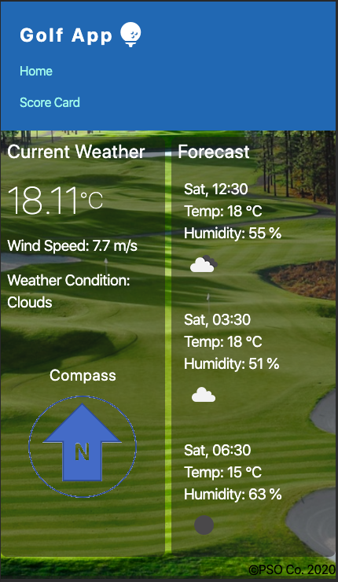
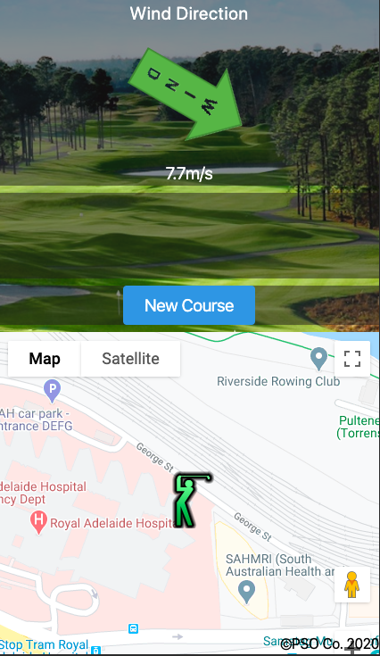
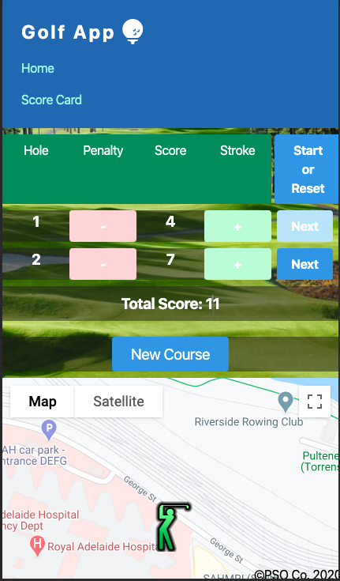

<h1>Golf App-v2</h1>

<h4>App Infomation</h4>

This application is developed to assist golfer on the course.

Feature include: 
<ul><li>Weather details</li><li> Map marking</li><li>Score Card</li>
</ul>

Setting up on mobile devices:
<ul><li>Enable Location</li><li>Enable WiFi</li><li>Enable Motion and Orientation settings</li>
</ul>
<h4>User's Story</h4>
<ul>
<li>
When the App is loaded, Weather & forecast details is displayed 
</li>
<li>
The map of the course is displayed with user's current location marked.
</li>
<li>
If previously course data is available, hole on the course will be marked on the map.
</li>
<li>
Compass and wind direction will be indicated.
</li>
</ul>

Game start

<ul>
<li>
At the 1st hole, I click on a tab and the score card is displayed.
</li>
<li>

Under par, I press [ - ]. Over par, I press [ + ]. Total is tallied and displayed.

Or simply use the add storke button to record the stroke made.

</li>
<li>
Completion at a hole , I click on the [Next] button.
</li>
<li>
A new line on the score card is displayed and my current locaiton is logged on the map indicating the position of the hole with the hole number.
</li>
<li>
Process continue until game completed at hole number 18.
</li>
<li>
To reset score card, I press [Start or Reset]
</li>
<li>
To reset course data, I press [New Course]
</li>
</ul>
<a href='https://a1718367.github.io/GolfApp-v2/'>Golf App</a>

